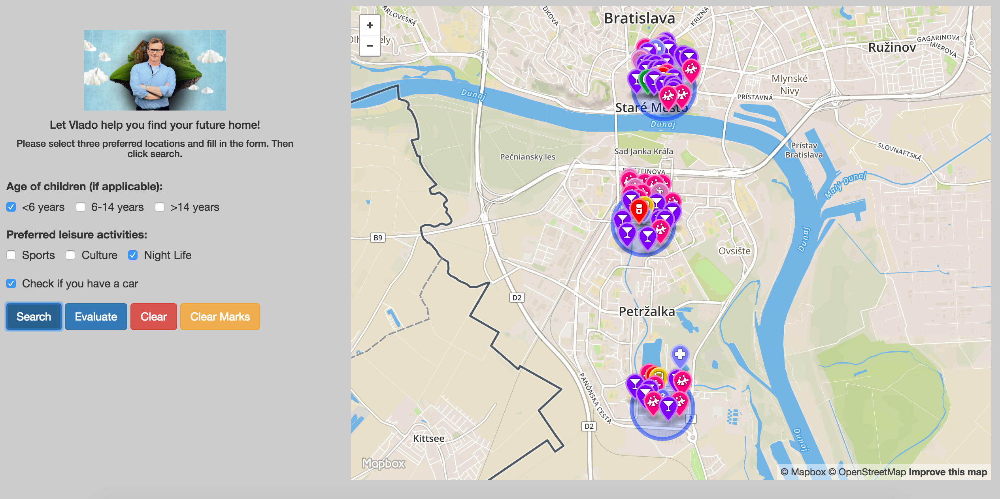
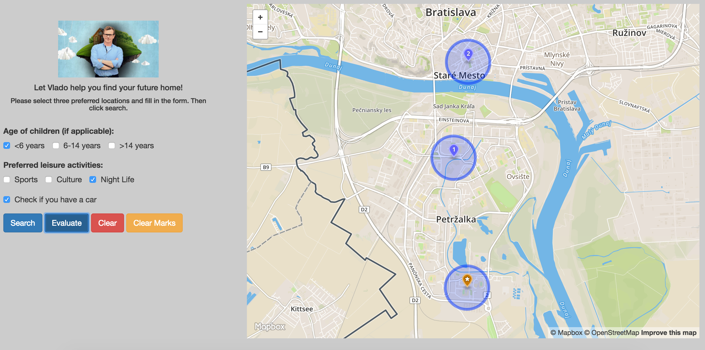

# Úvod

Aplikácia funguje ako pomocník pre výber lokality bývania v rámci Bratislavy. Je možné zvoliť na mape tri body, pre ktoré môžeme zobraziť dôležité body v okolí (do 500 metrov), alebo vyhodnotiť, ktorá z troch zvolených lokalít je najlepšia pre život. Vyhľadávanie aj vyhodnocovanie berie do úvahy aj dotazník, ktorý používateľ môže ale nemusí vyplniť.
Najdôležitejšie funkcie sú:
- zistenie občianskej vybavenosti (nájdenie najbližšej lekárne, zastávky MHD a nemocnice, resp. lekára)
- zobrazenie možnosti parkovania auta/motocykla v oblasti
- zistenie možností trávenia voľného času (šport, kultúra, nočný život)
- vypočítanie percentuálneho podielu zelenej plochy (parkov) v okolí 500 metrov
- vyhľadanie škôl a ihrísk podľa veku dieťaťa
- vyhodnotenie a zobrazenie najlepšej lokality podľa zvolených kritérii

Aplikácia má backend aj frontend časť, backend je riešený pomocou technolódie node.js a frameworku sails.js, ktorý používa základy ExpressJS. Aplikácia používa databázu Postgis. Frontendová časť aplikácie je riešená v HTML a CSS a používa knižnicu Mapbox.js.

# Frontend

Frontendová aplikácia je statická HTML stránka (`index.html`), rozdelená na dve časti. V pravej časti máme mapu vygenerovanú pomocou mapbox.js a v ľavej dotazník a riadiace tlačidlá. Na základe používateľského vstupu v dotazníku je možné pridať dodatočné kritériá na vyhodnocovanie a zobrazenie objektov v okolí zvoleného bodu. Stránka potrebuje pre svoj chod JavaScript súbory (`main.js`), (`searches.js`) a (`ratings.js`), ktoré sa nachádzajú v priečinku assets. Tieto súbory obsahujú funkcionalitu potrebnú na prepojenie frontendu a backendu a vyhodnocovanie vstupu. Mapa na stránke je v klasickom štýle mapbox.streets bez dodatočných úprav.

Aplikácia umožňuje používateľovi zvoliť si na mape kliknutím tri body, s ktorými bude následne pracovať. Po zvolení bodov si môže používateľ vytvoriť vlastný filter, na základe ktorého bude prebiehať vyhodnotenie a vyhľadávanie v mape. Po zvolení bodov a vytvorení filtra je možné použiť dve akčné tlačidlá - Search a Evaluate. 

Takto vyzerá výstup aplikácie po použití tlačidla vyhľadávania Search:


Po vyhľadaní si môžeme vyhodnotiť vyhľadávanie pomocou tlačidla Evaluate:


V tomto prípade aplikácia vyhodnotila ako najlepšiu lokalitu okrajovú časť Petržalky. Vidíme, že aplikácia nám zvýraznila najlepšiu lokalitu zmenou kurzora na zlatú farbu a ikonu s hviezdičkou. 

# Backend

Backend aplikácie pracuje s databázou v Postgis a je riešený pomocou dvojice node.js a frameworku sails.js. Backend je zodpovedný za spúštanie dopytov do databázy a poslanie výsledku dopytu frontendovej časti. Dopyty v SQL sú uložené ako služba v súbore QueryService.js a nachádzajú sa v priečinku api/services.

## Dáta

Stiahol som si dáta pre oblasť Bratislavy z Open Street Maps. Tento export obsahuje veľké množstvo dát a niekoľko tabuliek, z ktorých sú však pre moju aplikáciu potrebné len tabuľky bodov a polygónov. Dáta som naimportoval do Postgis pomocou nástroja `osm2pgsql`. Logika backendovej časti sa nachádza v (`api/controllers/HouserController.js`), kde sa vykonávajú dopyty. Aplikácia posiela frontendu dáta vo formáte JSON, ktoré obsahujú aj bod vo formáte geojson a informácie o bode. Na konverziu výsledkov do formátu geojson som použil funkciu `st_asgeojson()`. 

Hotel data is coming directly from Open Street Maps. I downloaded an extent covering whole Slovakia (around 1.2GB) and imported it using the `osm2pgsql` tool into the standard OSM schema in WGS 84 with hstore enabled. To speedup the queries I created an index on geometry column (`way`) in all tables. The application follows standard Rails conventions and all queries are placed in models inside `app/models`, mostly in `app/models/hotel.rb`. GeoJSON is generated by using a standard `st_asgeojson` function, however some postprocessing is necessary (in `app/controllers/search_controller.rb`) in order to merge all hotels into a single geojson.

## Api

**Zobraz všetky škôlky v okolí**

`GET /api/kindergartens?point[]=17.14493751525879&point[]=48.15652431161732&distance=500`

**Zobraz všetky školy v okolí**

`GET /api/schools?point[]=17.14493751525879&point[]=48.15652431161732&distance=500`

**Zobraz všetky školy v okolí**

`GET /api/colleges?point[]=17.113041&point[]=48.144438&distance=500`

**Zobraz detské ihriská v okolí**

`GET /api/playgrounds?point[]=17.113041&point[]=48.144438&distance=500`

**Zobraz celkovú oblasť zelenej plochy (parkov) v okolí**

`GET /api/area_parks?point[]=17.113041&point[]=48.144438&distance=500`

**Zobraz športoviská v okolí**

`GET /api/sports?point[]=17.113041&point[]=48.144438&distance=500`

**Zobraz kultúrne zariadenia (divadlá, knižnice, galérie...) v okolí**

`GET /api/cultures?point[]=17.113041&point[]=48.144438&distance=500`

**Zobraz možnosti nočného života (bary, kluby, reštaurácie) v okolí**

`GET /api/nightlife?point[]=17.113041&point[]=48.144438&distance=500`

**Zobraz najbližšiu lekáreň**

`GET /api/lekaren?point[]=17.113041&point[]=48.144438&distance=500`

**Zobraz najbližšiu autobusovú zastávku**

`GET /api/bus?point[]=17.113041&point[]=48.144438&distance=500`

**Zobraz nemocnicu/ambulanciu v okolí**

`GET /api/hospital?point[]=17.113041&point[]=48.144438&distance=500`

**Zisti, či sa v okolí nachádza parkovisko**

`GET /api/car?point[]=17.113041&point[]=48.144438&distance=500`

### Response

Aplikácia poskytuje odpoveď vo forme JSON, ktorý obsahuje nájdené body vo formáte geojson (alebo stredy polygonu - pomocou st_centroid), prípadne číselnú hodnotu a informácie k nim. Tieto informácie sa následne prepošlú na frontend, ktorý ich zobrazí na mape.

Ukážka odpovedí API:
```
  {
    "name": "Gymnázium Matky Alexie",
    "geojson": "{\"type\":\"Point\",\"coordinates\":[17.1106402520042,48.1421395989058]}"
  }

  {
    "name": "Pod Manderlom",
    "amenity": "pharmacy",
    "geojson": "{\"type\":\"Point\",\"coordinates\":[17.1125850147628,48.1442369096345]}",
    "distance": 40.63759815
  }
```